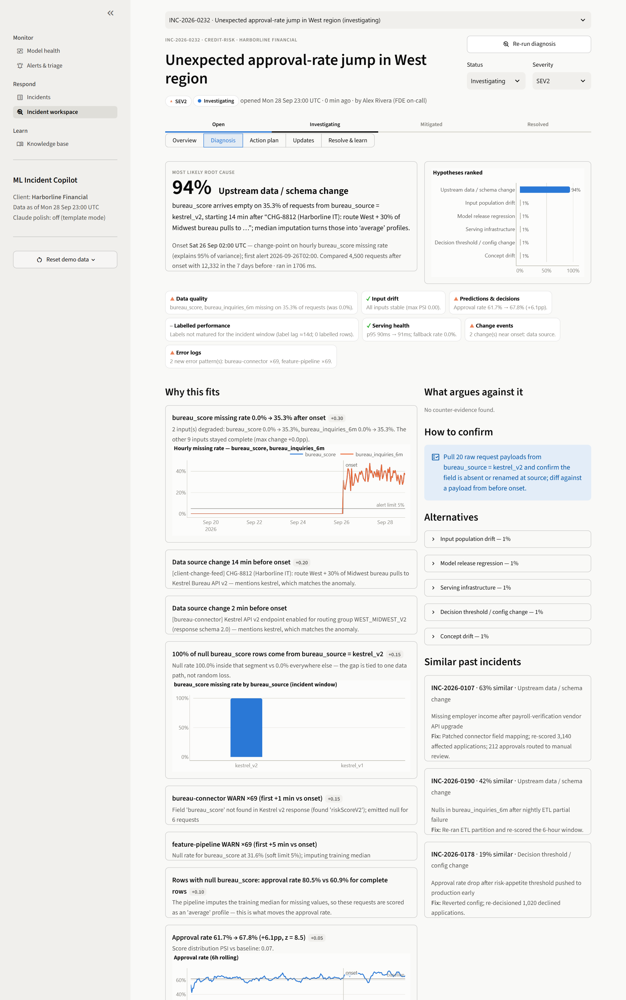
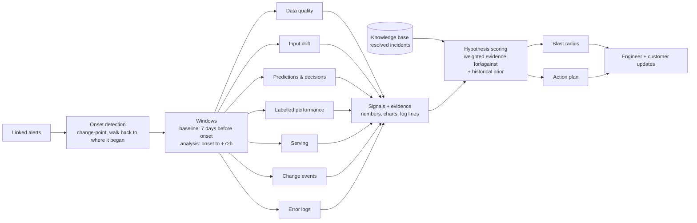
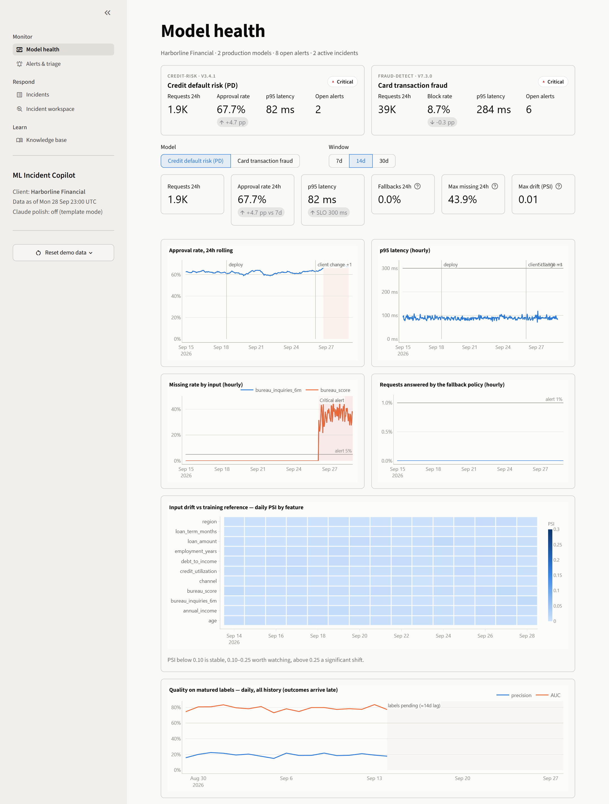
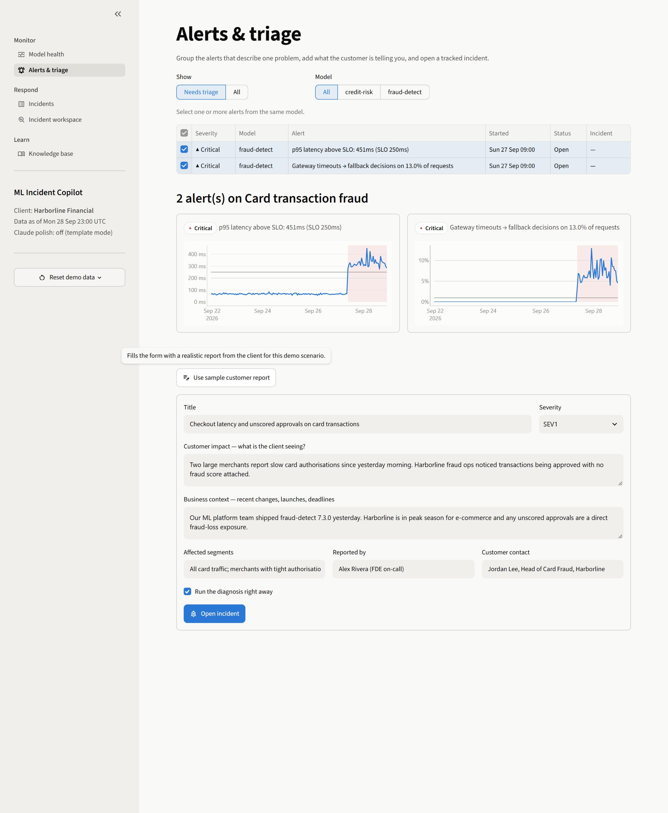
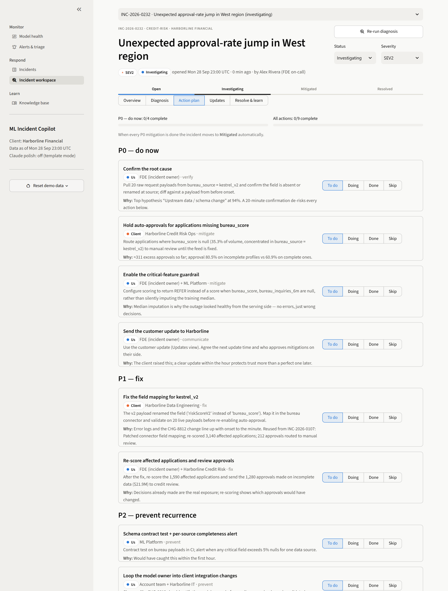
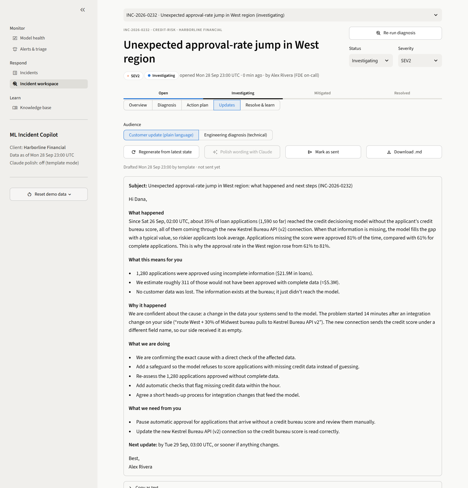
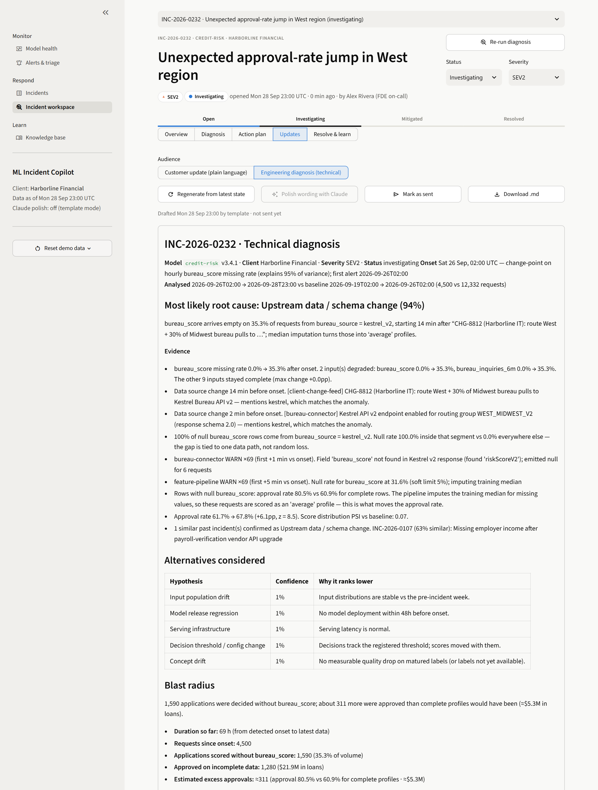
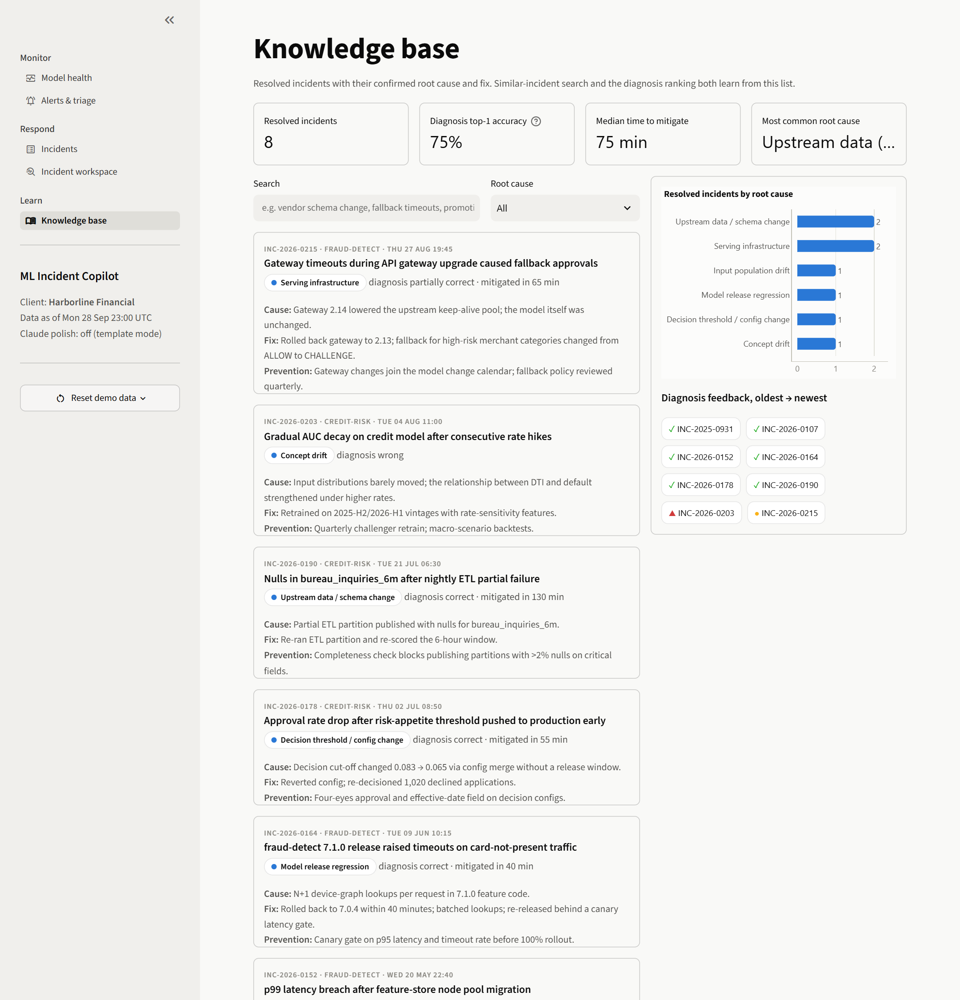

# ML Incident Copilot

[](https://github.com/HowenT/ml-incident-copilot/actions/workflows/ci.yml)

**From a model alert to a confirmed root cause, an owner-assigned action plan, and a customer-ready update, with the evidence behind every claim.**

ML models in production rarely fail with an error. They fail quietly. An upstream field gets renamed, a new customer segment shows up, or a release adds 200 ms. The model keeps returning scores and the business keeps making decisions on them. The hard part is not the dashboard. It is the next hour: which alerts belong together, what actually broke, who has to do what, and what to tell the customer.

This project runs that hour as a workflow, the way a Forward Deployed Engineer would at a client:

**monitor → triage alerts into an incident → explainable diagnosis → action plan → two updates (engineering + customer) → resolve and feed the knowledge base.**



> All data is synthetic. "Harborline Financial" is a fictional lender and card issuer. The two models are real scikit-learn models trained on simulated populations, and the incidents are injected into their production traffic, so every symptom you see comes from the model's actual behaviour.

---

## What's inside

| Capability | What it does |
|---|---|
| **Simulated client environment** | A credit-default (PD) model and a card-fraud model, 30 days of prediction logs (~150k rows), delayed ground-truth labels, service logs and a change feed, with three realistic incidents plus noise. |
| **Monitoring dashboard** | Decision rates, p95 latency vs SLO, fallback decisions, missing values per input, a feature-by-day drift heatmap (PSI vs training reference), quality on matured labels, and the change feed. |
| **Incident workflow** | Select related alerts, capture the customer's report (impact, context, segments, contact) and open a tracked case with severity and status (Open → Investigating → Mitigated → Resolved) and a full audit timeline. |
| **Root-cause diagnosis** | Seven checks (data quality, input drift, predictions/decisions, labelled performance, serving, change events, error logs) produce signals. Six root-cause hypotheses are ranked from those signals, and each shows the evidence for it, the evidence against it, and how to confirm it. |
| **Action plan** | Verify → mitigate → fix → prevent → communicate. Every action has an owner (us or the client), a priority, and a "why" linked to the evidence. Finishing all P0 mitigations moves the case to *Mitigated*. |
| **Two-audience summaries** | A technical diagnosis for engineers and a plain-language update for the client's business owner, built from the same facts. An optional Claude pass polishes the wording and is instructed not to add facts. |
| **Feedback loop** | Resolving a case records the confirmed root cause, the fix, and whether the diagnosis was right. Resolved cases feed similar-incident search and a historical prior in hypothesis ranking. The knowledge base tracks top-1 diagnosis accuracy. |
| **Engineering** | FastAPI, SQLAlchemy (SQLite by default), Streamlit and Plotly, a Docker Compose setup, 16 backend tests, and a Playwright UI smoke test that walks the whole demo flow. |

## The three incidents in the demo data

| Incident | What actually happened | What the copilot concludes | Key evidence it surfaces |
|---|---|---|---|
| **Approval-rate jump (credit)** | The client routed West-region bureau pulls to a new bureau API version that renamed `bureau_score`. The connector emitted nulls, the pipeline silently imputed the median, and risky applicants looked average. | **Upstream data / schema change (≈94%)** | 36% nulls, all from `bureau_source = kestrel_v2`. Onset 14 minutes after the client's change ticket. Connector logs name the new field. Incomplete profiles are approved 79% of the time vs 63% for complete ones. |
| **Checkout latency (fraud)** | Release 7.3.0 added real-time features from a feature-store namespace with cache TTL 0. p95 latency rose 5×, and the gateway's fallback policy approved unscored transactions. | **Model release regression (≈75%)**, with serving infrastructure as the plausible runner-up | Degradation confined to 7.3.0. Deploy 6 minutes before onset. Feature-store cache-miss logs. Thousands of transactions approved with no fraud score. |
| **Travel purchases declined (fraud)** | The client launched a co-brand travel card. New, legitimate cardholders transact abroad with large amounts on weeks-old accounts, a region the model associates with fraud. | **Input population drift (≈89%)** | A new segment (`card_program = travelplus`) explains the drift completely. Precision on matured labels fell from 24% to 5%, and 85% of false-positive blocks come from that segment. The launch appears in the change feed. |

A two-hour network blip early in the month produces alerts that auto-resolve; diagnosed, it comes out as *serving infrastructure*.

## How the diagnosis works



- **Onset.** Alerts fire late because of rolling windows and persistence rules. The engine fits a mean-shift change-point on the primary symptom (hourly missing rate, fallback rate, p95 or decision rate) and walks back to where the shift began. On the demo data it recovers the true onset to the hour for step changes, and within a few hours for the gradual launch ramp.
- **Localisation.** For every anomaly the engine asks *where* it is concentrated: nulls by data source, false positives by card programme, latency by model version, drift with and without a segment. This is usually what turns a symptom into a cause.
- **Scoring.** Each hypothesis is a transparent rule: `score = Σ w·support − Σ w·contradiction + 0.15 · historical prior`. Confidence is a softmax over hypotheses. The weights are readable in [`hypotheses.py`](backend/app/diagnosis/hypotheses.py), so an engineer can see exactly why something ranked where it did.
- **Why rules and not an LLM?** Diagnosis for a customer has to be traceable and testable. The tests assert that the engine recovers each injected root cause and onset. The LLM is used where it is strong and low-risk: rewording the updates, with every number pinned to the draft.
- **Label lag is handled explicitly.** Credit outcomes take ≈14 days to arrive. The engine says so and reasons from data, decision and log signals instead of pretending to measure accuracy.

## Screenshots

| | |
|---|---|
|  |  |
|  |  |
|  |  |

## Quickstart

**Local (Python 3.12+)**

```bash
python -m venv .venv
# Windows: .venv\Scripts\activate    macOS/Linux: source .venv/bin/activate
pip install -r requirements.txt
```

Then start the API and the UI in two terminals (or run `scripts/dev.ps1` / `scripts/dev.sh`):

```bash
uvicorn backend.app.main:app --port 8000
```

```bash
streamlit run frontend/app.py
```

Open http://localhost:8501. The first API start trains the models and seeds 30 days of data, which takes about 20 seconds. The OpenAPI docs are at http://localhost:8000/docs.

**Docker**

```bash
docker compose up --build
```

**Optional: Claude polish for the updates.** Set `ANTHROPIC_API_KEY` for the API process. The *Polish wording with Claude* button then rewrites both drafts for their audience without adding facts. Everything else works without a key.

**Fresh demo data.** Use *Reset demo data* in the sidebar, or run `python -m backend.app.seed`, so the data ends "now". Run it right before recording a demo.

## Demo in two minutes

1. **Model health.** Both models are critical, and the credit approval rate is up about 7pp.
2. **Alerts & triage.** Select the two credit alerts, click *Use sample customer report*, then *Open incident*.
3. **Diagnosis.** Upstream schema change at ≈94%. Walk the evidence: nulls tied to one data source, the client's change ticket 14 minutes before onset, connector logs, incomplete profiles approved more often.
4. **Action plan.** Mark the two P0 mitigations *Done*, and the case moves to *Mitigated*.
5. **Updates.** Read the customer update (no jargon, a clear ask of the client), then *Mark as sent*.
6. **Resolve & learn.** Confirm the root cause. The case joins the knowledge base and diagnosis accuracy updates.

The full shot list and voice-over are in [`docs/demo_script.md`](docs/demo_script.md).

## API (selected)

| Method | Path | Purpose |
|---|---|---|
| GET | `/api/overview` | Fleet health and KPIs per model |
| GET | `/api/models/{id}/metrics` · `/features` · `/performance` | Monitoring series |
| GET | `/api/alerts` | Alert episodes produced by the monitoring rules |
| POST | `/api/incidents` | Open an incident from alerts plus the customer report |
| POST | `/api/incidents/{id}/diagnose` | Run the diagnosis, generate actions and updates |
| PATCH | `/api/incidents/{id}/actions/{action_id}` | Update an action's status (auto-mitigates) |
| POST | `/api/incidents/{id}/summaries/regenerate` | Rebuild the updates (`use_llm` for Claude polish) |
| POST | `/api/incidents/{id}/resolve` | Record the confirmed root cause and feedback |
| GET | `/api/knowledge` · `/api/knowledge/stats` | Search resolved incidents; diagnosis accuracy |

## Tests

```bash
pip install -r requirements-dev.txt
pytest                              # 16 tests: stats, scenario diagnosis, API lifecycle
python scripts/ui_smoke_test.py     # drives the full demo flow in a real browser (API + UI running)
```

The scenario tests seed the environment at a fixed time and assert that each incident is diagnosed with the right root cause and onset. They also check that the later release incident does not leak into the drift diagnosis, and that the auto-resolved blip is classified as infrastructure.

Continuous integration runs this backend suite on Python 3.12 and 3.13 for every change to `main` and every pull request.

## Project layout

```
backend/app/
  services/simulator.py     client scenario: populations, model training, traffic, incidents, logs
  services/monitoring.py    hourly metrics, rolling PSI vs reference, matured-label performance, alert rules
  diagnosis/checks.py       the seven checks -> signals + evidence
  diagnosis/hypotheses.py   root-cause rules, weights, confidence
  diagnosis/engine.py       onset detection, windows, orchestration
  diagnosis/impact.py       blast radius in requests, decisions and dollars
  services/actions.py       evidence-linked action plan
  services/summaries.py     engineer + customer updates
  services/similarity.py    similar incidents and historical prior
  services/workflow.py      incident lifecycle and audit trail
  services/llm.py           optional Claude polish
  routers/                  FastAPI endpoints
frontend/                   Streamlit app (views/ = pages)
scripts/                    screenshots, UI smoke test, dev launchers
```

## Design notes and limitations

- **Synthetic but not scripted.** Incidents change the traffic or the serving layer, never the model outputs directly, so approval jumps, false declines and timeouts are emergent.
- **Rules are hand-weighted.** The historical prior is the only learned component today. A natural next step is to fit the weights on resolved incidents once there are enough of them.
- **The fraud prediction log is a 10% sample.** Blast-radius counts are extrapolated and labelled as such.
- **Out of scope:** authentication, multi-tenancy, and cross-model incidents. SQLite is the tested store. `DATABASE_URL` accepts other SQLAlchemy URLs, but only SQLite has been exercised.

## Roadmap

- Learn hypothesis weights from resolved incidents; calibrate confidence
- Integrations: Slack/Teams updates, Jira tickets, PagerDuty alerts
- Real monitoring sources (Evidently, Arize, Datadog) instead of the simulator
- "Ask the incident": grounded Q&A over the evidence with citations

---

Built with Python 3.13 · FastAPI 0.141 · SQLAlchemy 2.1 · pandas 3.0 · scikit-learn 1.9 · Streamlit 1.64 · Plotly 7.1.
